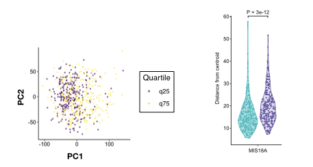
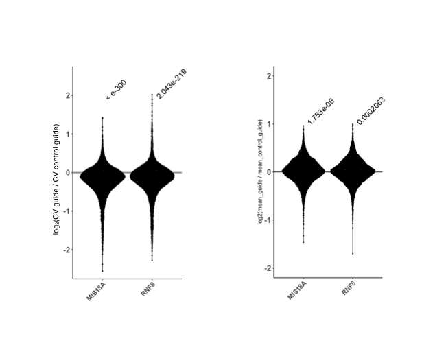
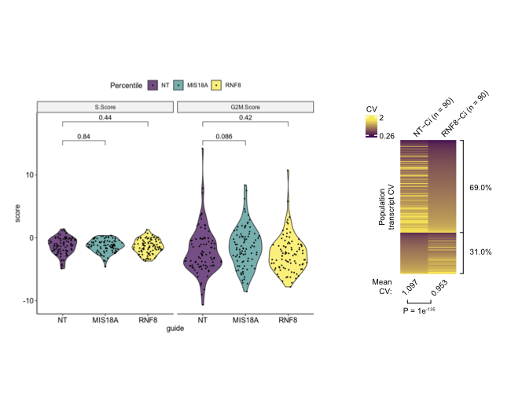
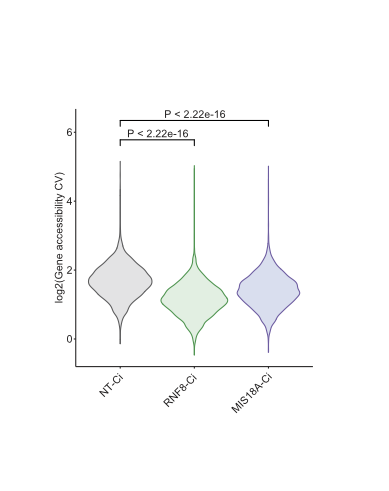

# txnheterogeneity

## Overview

This package quantifies heterogeneity in between groups of bulk RNA-seq samples,
single cell RNA-seq samples, and single cell ATAC-seq samples. Bulk RNA-seq, 
scRNA-seq, and scATAC-seq heterogeneity can be quantified by significant changes 
in gene coefficient of variation (CV) across the transcriptome. Additionally, this
package allows heterogeneity quantification between bulk RNA-seq samples using the 
'spread' of samples in principal component space as a proxy for this metric. 

This package heavily utilizes [ArchR](https://www.archrproject.com) on the 
backend for peak calling to quantify scATAC-seq heterogeneity differences between samples.


## Installation

- Install the latest version from
  [GitHub](https://github.com/ssobt/txnheterogeneity) as follows:

``` r
# Install
if(!require(devtools)) install.packages("devtools")
devtools::install_github("ssobt/txnheterogeneity")
```

Please make sure you have packages in the DESCRIPTION file installed, 
some may need manual installation via install.packages(), BiocManager::install(), 
or installation with conda if you are using a conda environment (recommended). 
If these do not automatically install and manual installation is required, use the following for txnheterogeneity: 

``` r
# Install
if(!require(devtools)) install.packages("devtools")
devtools::install_github("ssobt/txnheterogeneity", upgrade = "never", lib = "/txnheterogeneity_package_destination_folder/")
```

## Usage

### Comparing heterogeneity between two bulk RNA-seq samples or between groups of samples

``` r
.libPaths("/txnheterogeneity_package_destination_folder/") ## add location of package to searchable library paths
library(txnheterogeneity)

## Example 1: Compare heterogeneity between two known groups of samples
## input_mtx is a matrix with rows as genes and columns as samples
## g1 and g2 are character vectors with column names in input_mtx
# set seed for reproducibility of bkg distribution sampling
set.seed(123)
samples = sample(colnames(input_mtx), 200)
g1 = samples[1:100]
g2 = samples[101:200]
out = bulk_het(data = input_mtx, g1 = g1, g2 = g2, cores = 1)


## Example 2: Compare heterogeneity between samples stratified by expression of certain genes
## input_mtx is a matrix with rows as genes and columns as samples
# set seed for reproducibility of bkg distribution sampling
set.seed(123)
## will stratify samples based on top and bottom 25% expression of each stratifier gene
## top 25% (q75) will be compared to bottom 25% (q25)
out = bulk_het(data = input_mtx, quant = 0.75, stratifiers = rownames(input_mtx)[1:10], cores = 10) 

### Plot ###

plot_bulk_het(bulk_out = out, components_to_plot = c(1,2), plot_type = 'PC scatter', stratifier_gene = 'MIS18A') +
  ggplot2::scale_color_viridis_d()

plot_bulk_het(bulk_out = out, plot_type = 'distance violin', stratifier_gene = 'MIS18A')

```


### Comparing heterogeneity between scRNA-seq samples 

``` r
.libPaths("/txnheterogeneity_package_destination_folder/") ## add location of package to searchable library paths
library(txnheterogeneity)

## make sure scRNA-seq samples are in a Seurat object with a specified column in the metadata for sample identity

sc_het_out = sc_het(seurat_obj = CRISPRa_seurat, cutoff = 0.1, seed = 42, sample_cells_per_guide_cutoff = 50,
  meta_data_sample_column = 'guide', sample_names = c('NT', 'RNF8', 'MIS18A'), control_sample_name = 'NT')

### Plot ###

plot_sc_het(sc_het_output, plot_type = 'CV violin')

plot_sc_het(sc_het_output, plot_type = 'mean violin', sample_names = c('RNF8-Ci', 'MIS18A-Ci'))

plot_sc_het(sc_het_output, plot_type = 'cell cycle')

plot_sc_het(sc_het_output, plot_type = 'heatmap', sample_names = 'RNF8-Ci')

```



### Comparing heterogeneity between scATAC-seq samples 

``` r
.libPaths("/txnheterogeneity_package_destination_folder/") ## add location of package to searchable library paths
library(txnheterogeneity)

## load in quantified scATAC-seq fragment files (files ending in sample_name.fragments.tsv.gz) from
## the 10x Genomics Cell Ranger ATAC pipeline or other software -- in this examples the path to all file_names is
## inputted as a character vector into the scATAC_fragment_files option

## If you wish to combine sample replicates, please combine them into a list by specifying a vector with 
## each sample present in your data and another vector with their renamed version as follows:

rep_map = list(c('NTCi-1', 'NTCi-2', 'NTCa-1', 'NTCa-2', 'RNF8-Ci-1', 'RNF8-Ci-2', 'RNF8-Ca-1', 'RNF8-Ca-2', 'MIS18A-Ci-1', 'MIS18A-Ci-2', 'MIS18A-Ca-1', 'MIS18A-Ca-2'), c('NTCi', 'NTCi', 'NTCa', 'NTCa', 'RNF8-Ci', 'RNF8-Ci', 'RNF8-Ca', 'RNF8-Ca', 'MIS18A-Ci', 'MIS18A-Ci', 'MIS18A-Ca', 'MIS18A-Ca'))

out = scATAC_het(scATAC_fragment_files = paste0(folder, '/', file_names), 
sample_names = names(file_names), 
replicate_map = rep_map, ## use option only if replicates present that you wish to combine
samples_to_analyze = c('NTCi', 'RNF8-Ci', 'MIS18A-Ci'), control_sample_name = 'NTCi',
savepath = savep, 
threads = 35, 
genome = "hg38", 
TSS_bed_path = '/home/ssobti/projects/heterogeneity_brian/uploaded_data/scATACseq/genome/GRCh38_transcriptsOnly.tss.bed',
macs2_path = '/home/ssobti/miniconda3/envs/archr/bin/macs2') ## please make sure to provide this if using macs2 for peak calling, ArchR gets confused if multiple copies exist


### Plot ###

plot_scATAC_het(scATAC_het_out, plot_type = 'CV between samples', sample_names = c('RNF8-Ci', 'MIS18A-Ci'))

```



